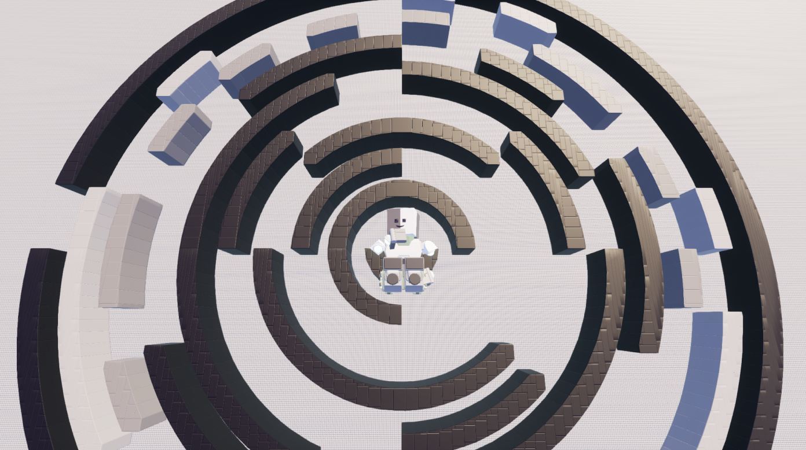

# Brickadia Maze Generator

The **Brickadia Maze Generator** is a Rust-based tool for generating and visualizing circular mazes. It creates mazes with concentric rings and divisions, and exports them as both visual images and Brickadia-compatible save files. The project leverages parallel processing for efficient computation and provides a modular design for customization.



---

## Features

- **Circular Maze Generation**: Generate mazes with concentric rings and divisions.
- **Brickadia Export**: Export mazes as Brickadia-compatible `.brs` save files.
- **Visualization**: Render mazes as images with optional debug overlays.
- **Customizable Parameters**: Configure maze dimensions, ring widths, and initial divisions.
- **Efficient Rendering**: Uses parallel processing for grid-based polygon decomposition and rendering.
- **Pathfinding**: Includes a solution path visualization for the generated maze.

---

## Project Structure

The project is organized into modular components for ease of development and extensibility:

### Core Modules

1. **[src/maze/maze.rs](src/maze/maze.rs)**:
   - Implements the `ThetaMaze` struct for generating and rendering circular mazes.
   - Handles maze generation using a backtracking algorithm with seeded randomization.
   - Supports exporting mazes as Brickadia bricks and visualizing them as images.

2. **[src/geometry/arc.rs](src/geometry/arc.rs)**:
   - Defines the `Arc` and `WedgeArc` structs for representing and rendering circular arcs.
   - Converts arcs into Brickadia-compatible bricks and polygons.

3. **[src/geometry/decompose.rs](src/geometry/decompose.rs)**:
   - Provides a `render_as_squares` function for decomposing rectilinear polygons on a Manhattan grid into grid-aligned rectangles.
   - Optimizes rendering by merging contiguous grid cells into larger rectangles.

4. **[src/draw/draw.rs](src/draw/draw.rs)**:
   - Implements the `DebugImage` struct for visualizing mazes and polygons.
   - Includes utility functions for drawing arcs, lines, points, and filled polygons.

5. **[src/utils/points.rs](src/utils/points.rs)**:
   - Defines the `Point` struct for representing 2D coordinates.
   - Includes utility methods for creating and manipulating points.

6. **[src/geometry/polygon.rs](src/geometry/polygon.rs)**:
   - Defines the `Polygon` struct for representing 2D polygons.
   - Provides methods for constructing, updating, and checking point containment within polygons.

---

## Installation

1. **Clone the Repository**:
   ```bash
   git clone https://github.com/your-username/brickadia-maze-generator.git
   cd brickadia-maze-generator
1. **Install Dependencies: Ensure you have Rust installed. Then, run:**
```bash
cargo build
cargo test generate_maze
cargo test render_arc
